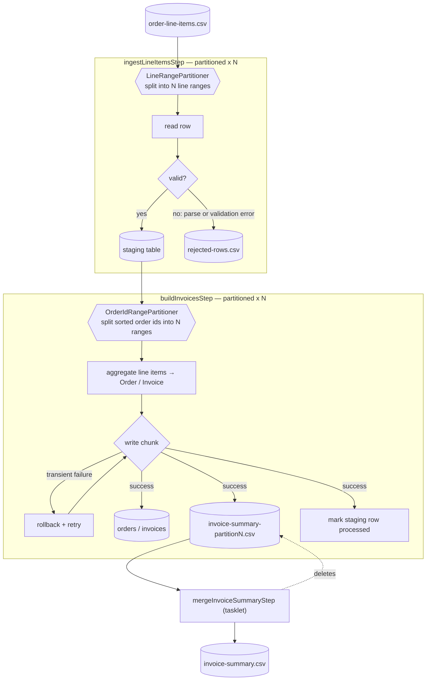
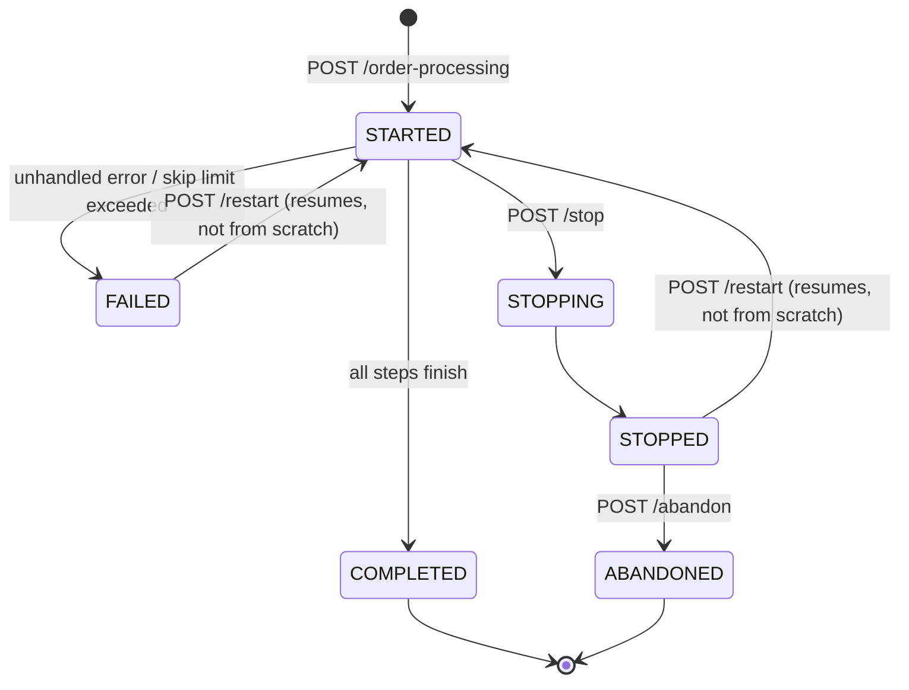

# Daily E-commerce Order & Invoice Processing

A Spring Batch demo that ingests a CSV of order line items, validates and aggregates them into invoices, and persists the results to PostgreSQL — with real fault-tolerance (skip, retry), partitioned parallel processing, operational job control, and a full observability stack. Built to demonstrate production-shaped patterns, not a happy-path-only toy.

## What it does

1. **Ingest** — reads a CSV of raw order line items, validates each row, and lands valid ones in a staging table. Malformed rows (bad CSV format, non-numeric price, bad date) and business-rule violations (negative quantity/price, blank customer/order id) are skipped and logged to `rejected-rows.csv`, not silently dropped or allowed to crash the job.
2. **Aggregate & invoice** — groups staged line items by order, computes tax/totals, and persists an `Order` + `Invoice` per order, with a genuinely simulated transient-write failure to exercise a real retry policy.
3. **Merge** — recombines the partitioned output into one `invoice-summary.csv`.

The whole pipeline runs partitioned across configurable worker threads, is idempotent on re-trigger, and exposes REST endpoints to launch, inspect, stop, restart, and abandon job executions.

## Tech stack

- Spring Boot 4.1.1 (Java 21)
- Spring Batch 6.0.5 — chunk-oriented steps, partitioning, fault tolerance, `JobOperator`
- Spring Data JPA / Hibernate, PostgreSQL
- Spring Web (REST API)
- Spring Boot Actuator + Micrometer (Prometheus registry)
- Lombok
- Prometheus + Grafana (via Docker Compose)

## Quickstart

Requires Docker and a local JDK 21 (the Maven wrapper is checked in, no local Maven install needed).

```bash
# 1. Start Postgres, Prometheus, and Grafana
docker compose up -d

# 2. Run the app (Windows: use mvnw.cmd)
./mvnw spring-boot:run

# 3. Trigger the job
curl -X POST http://localhost:8080/api/batch/jobs/order-processing

# 4. Check its status
curl http://localhost:8080/api/batch/jobs/executions/1
```

The job does **not** run automatically on startup (`spring.batch.job.enabled=false`) — it's always triggered explicitly via the REST endpoint above. Sample input data lives at `src/main/resources/data/order-line-items.csv` (regenerate it with `python generate.py`, which writes ~100,000 rows including a handful of deliberately invalid ones to exercise the skip path).

## REST API

| Method | Endpoint | Description |
|---|---|---|
| `POST` | `/api/batch/jobs/order-processing` | Launch a new job execution |
| `GET` | `/api/batch/jobs/executions/{id}` | Get a job execution's status/counts |
| `POST` | `/api/batch/jobs/executions/{id}/stop` | Request a graceful stop of a running execution |
| `POST` | `/api/batch/jobs/executions/{id}/restart` | Restart a stopped/failed execution (resumes, doesn't start over) |
| `POST` | `/api/batch/jobs/executions/{id}/abandon` | Mark a non-restartable execution as abandoned |

`stop`/`restart`/`abandon` are backed by Spring Batch's `JobOperator`. Errors map to proper HTTP status codes: `404` for an unknown execution id, `409` for an invalid state transition (e.g. restarting an execution that's still running).

## Architecture

### Job flow



Both processing steps are **partitioned**: the input is split into disjoint ranges up front (line ranges for the CSV, sorted order-id ranges for the staging table) so each partition gets its own reader/writer instance and runs fully in parallel — no shared mutable state, no synchronization needed. Partition count is configurable via `batch.partition-grid-size` (default 6) and controls both the number of partitions and the worker thread pool size.

- **`ingestLineItemsStep`** — reads the CSV, validates each row against a set of pluggable business rules, writes valid rows to a staging table. Skip policies handle both parse failures and validation failures independently, with every rejected row logged (stage, reason, timestamp, raw content) to `rejected-rows.csv`.
- **`buildInvoicesStep`** — reads distinct unprocessed order ids from staging, aggregates their line items into an `Order`/`Invoice`, and writes the result to three places in one transaction: the database, a per-partition CSV summary, and back to staging (marking it processed). A simulated transient failure demonstrates the retry policy — the chunk rolls back cleanly and retries, with a fallback to skip if retries are ever exhausted. `DistinctOrderIdItemReader` fetches order ids page-by-page via keyset pagination (`orderId > lastSeenId`, capped by `batch.order-id-page-size`) rather than loading a partition's entire id range into memory at once.
- **`mergeInvoiceSummaryStep`** — recombines the per-partition invoice-summary files into the single `invoice-summary.csv`, then removes the partition files.

### Fault tolerance

- **Skip**: malformed/invalid rows in step 1 are skipped up to `batch.skip-limit`, logged with full context, and don't fail the job.
- **Retry**: transient write failures in step 2 are retried up to `batch.retry-limit` before falling back to skip.
- **Idempotency**: re-triggering the job is safe — already-invoiced orders are detected and skipped rather than double-invoiced.

### Operational control

Spring Batch's `JobOperator` is exposed via REST for stopping, restarting, and abandoning executions — restart resumes from where the job left off (correct `JobParameters` handling under the hood), it isn't a fresh run from scratch.



## Configuration

All under the `batch.*` prefix (`application.properties`):

| Property | Default | Description |
|---|---|---|
| `batch.input-csv-path` | `classpath:data/order-line-items.csv` | Source CSV |
| `batch.rejects-file-path` | `rejected-rows.csv` | Skip audit log |
| `batch.invoice-summary-output-path` | `invoice-summary.csv` | Final merged output |
| `batch.tax-rate` | `0.18` | Applied to invoice subtotals |
| `batch.chunk-size` | `5` | Items per commit chunk |
| `batch.skip-limit` | `20` | Max skips before the step fails |
| `batch.retry-limit` | `3` | Max retry attempts on transient write failure |
| `batch.simulate-transient-write-failures` | `true` | Toggle the retry-policy demo |
| `batch.partition-grid-size` | `6` | Partitions (and worker threads) per step |
| `batch.order-id-page-size` | `500` | Max order ids fetched per keyset page in step 2's reader |

## Observability

`docker compose up -d` also starts:

- **Grafana** — `http://localhost:3000` (anonymous viewer access, no login needed):
  - *Batch Job & Step Executions* — every job/step execution row, queried directly from Postgres.
  - *Batch Metrics (Prometheus)* — job/step duration trends and JVM heap, queried from Prometheus.
- **Prometheus** — `http://localhost:9090`, scraping `/actuator/prometheus` every 15s.

Actuator endpoints:

```bash
curl http://localhost:8080/actuator/health
curl http://localhost:8080/actuator/metrics/spring.batch.job
curl http://localhost:8080/actuator/prometheus
```

## Project structure

```
src/main/java/com/batch/demo/
  batch/
    control/     JobOperator wrapper (stop/restart/abandon)
    dto/         Cross-step data transfer objects
    listener/    Skip listener → rejects audit log
    reject/      Rejected-record sink abstraction
    step1/       Ingest step: CSV mapping, validation processor, line-range partitioner
    step2/       Invoice step: aggregation, retry simulation, order-id partitioner, CSV merge
    validation/  Pluggable business-rule validators (Open/Closed)
  config/        Job/step wiring, batch properties
  domain/        JPA entities
  repository/    Spring Data repositories
  web/           REST controller, exception handling, DTOs
```

## Testing

```bash
./mvnw test                                              # all tests
./mvnw test -Dtest=InvoiceCalculatorTest                  # single class
./mvnw test -Dtest=DefaultOrderLineValidatorTest#rejectsANegativeQuantity   # single method
```

`DefaultOrderLineValidatorTest` and `InvoiceCalculatorTest` are plain unit tests. `DemoApplicationTests` loads the full Spring context and requires Postgres running (`docker compose up -d` first).

## Known limitations (demo scope)

- No schema migration tool (Flyway/Liquibase) — `spring.jpa.hibernate.ddl-auto=update`.
- Re-running the job re-inserts staging rows for already-invoiced orders (harmless — step 2 filters them out — but staging accumulates unprocessed rows over repeated runs).
- Grafana runs with anonymous viewer access and default credentials — fine for local use, not for anything internet-facing.
- Actuator endpoints are unauthenticated.

See `CLAUDE.md` for a deeper architectural walkthrough, including the specific Spring Batch 6.0 package-relocation gotchas and design rationale for each major decision.
