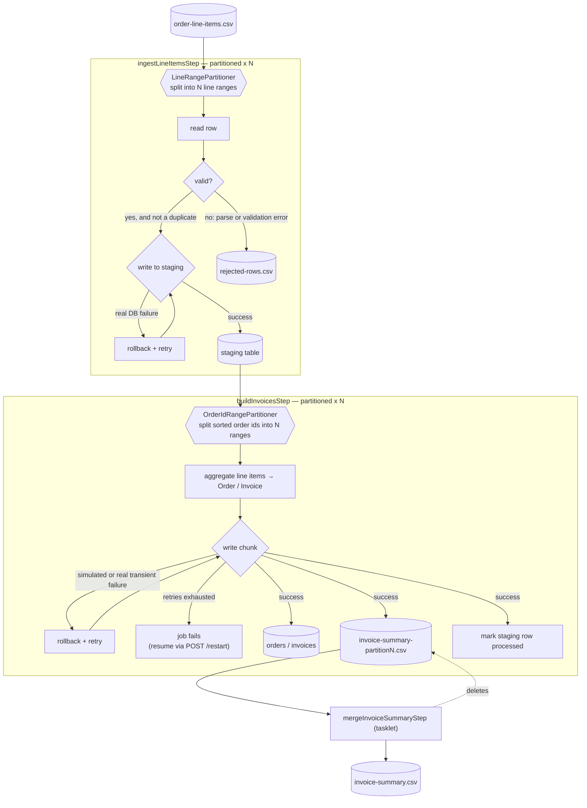
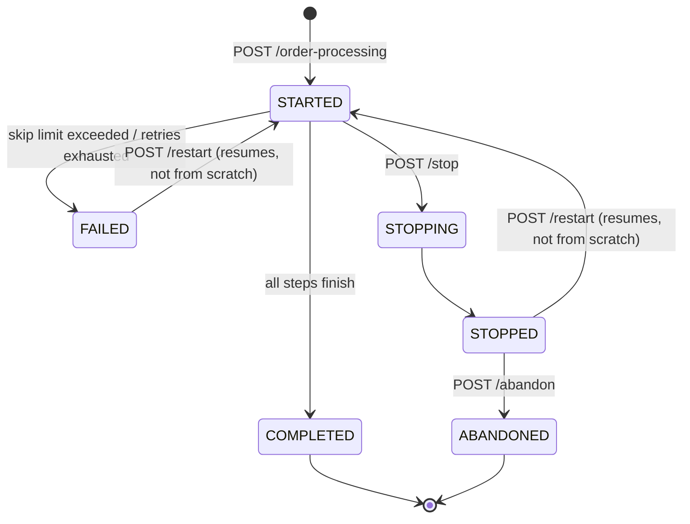

# Daily E-commerce Order & Invoice Processing

A Spring Batch demo that ingests a CSV of order line items, validates and aggregates them into invoices, and persists the results to PostgreSQL — with real fault-tolerance (skip, retry), partitioned parallel processing, operational job control, and a full observability stack. Built to demonstrate production-shaped patterns, not a happy-path-only toy.

## What it does

1. **Ingest** — reads a CSV of raw order line items, validates each row, and lands valid ones in a staging table. Malformed rows (bad CSV format, non-numeric price, bad date) and business-rule violations (negative quantity/price, blank customer/order id) are skipped and logged to `rejected-rows.csv`, not silently dropped or allowed to crash the job. A real DB failure (dropped connection, lock timeout) is retried instead, never skipped.
2. **Aggregate & invoice** — groups staged line items by order, computes tax/totals, and persists an `Order` + `Invoice` per order. A genuinely simulated transient-write failure exercises the retry policy on every run; a real DB failure is retried the same way — but unlike a malformed row, it's never silently skipped, since a skipped invoice would vanish with no audit trail. If retries are exhausted, the job fails loudly and is meant to be resumed via `POST .../restart`, not silently patched over.
3. **Merge** — recombines the partitioned output into one `invoice-summary.csv`.

The whole pipeline runs partitioned across configurable worker threads, is idempotent on re-trigger (both at the job-instance level and the row level), and exposes REST endpoints to launch, inspect, stop, restart, and abandon job executions.

## Tech stack

- Spring Boot 4.1.1 (Java 21)
- Spring Batch 6.0.5 — chunk-oriented steps, partitioning, fault tolerance, `JobOperator`
- Spring Data JPA / Hibernate, PostgreSQL
- Spring Web (REST API)
- Spring Boot Actuator + Micrometer (Prometheus registry, Tracing/OpenTelemetry)
- Lombok
- Prometheus + Grafana + Tempo (via Docker Compose)
- Testcontainers (integration tests — isolated, disposable Postgres per test class)

## Quickstart

Requires Docker and a local JDK 21 (the Maven wrapper is checked in, no local Maven install needed).

```bash
# 1. Start Postgres, Prometheus, Grafana, and Tempo
docker compose up -d

# 2. Run the app (Windows: use mvnw.cmd)
./mvnw spring-boot:run

# 3. Trigger the job
curl -X POST http://localhost:8080/api/batch/jobs/order-processing

# 4. Check its status
curl http://localhost:8080/api/batch/jobs/executions/1
```

The job does **not** run automatically on startup (`spring.batch.job.enabled=false`) — it's always triggered explicitly via the REST endpoint above. Sample input data lives at `src/main/resources/data/order-line-items.csv` (regenerate it with `python generate.py`, which writes ~100,000 rows including a handful of deliberately invalid ones to exercise the skip path).

## REST API

| Method | Endpoint | Description |
|---|---|---|
| `POST` | `/api/batch/jobs/order-processing?businessDate=YYYY-MM-DD` | Launch a new job execution (`businessDate` optional, defaults to today) |
| `GET` | `/api/batch/jobs/executions/{id}` | Get a job execution's status/counts |
| `POST` | `/api/batch/jobs/executions/{id}/stop` | Request a graceful stop of a running execution |
| `POST` | `/api/batch/jobs/executions/{id}/restart` | Restart a stopped/failed execution (resumes, doesn't start over) |
| `POST` | `/api/batch/jobs/executions/{id}/abandon` | Mark a non-restartable execution as abandoned |

`stop`/`restart`/`abandon` are backed by Spring Batch's `JobOperator`. Errors map to proper HTTP status codes: `404` for an unknown execution id, `409` for an invalid state transition (e.g. restarting an execution that's still running, or launching a job for a business date that's already completed). That last case is also the reason `businessDate` is overridable on launch: re-triggering with no query param twice on the same calendar day always gets the second one rejected with `409` by design (see Idempotency below) — pass a different `businessDate` to get a fresh run instead of waiting until tomorrow.

## Architecture

### Job flow


```mermaid
flowchart TD
    CSV[("order-line-items.csv")] --> P1{{"LineRangePartitioner\nsplit into N line ranges"}}

    subgraph Step1["ingestLineItemsStep — partitioned x N"]
        P1 --> R1["read row"]
        R1 --> V1{"valid?"}
        V1 -- "yes, and not a duplicate" --> W1{"write to staging"}
        V1 -- "no: parse or validation error" --> REJ[("rejected-rows.csv")]
        W1 -- "real DB failure" --> RETRY1["rollback + retry"]
        RETRY1 --> W1
        W1 -- "success" --> STG[("staging table")]
    end

    STG --> P2{{"OrderIdRangePartitioner\nsplit sorted order ids into N ranges"}}

    subgraph Step2["buildInvoicesStep — partitioned x N"]
        P2 --> AGG["aggregate line items → Order / Invoice"]
        AGG --> WR{"write chunk"}
        WR -- "simulated or real transient failure" --> RETRY2["rollback + retry"]
        RETRY2 --> WR
        WR -- "retries exhausted" --> FAIL["job fails\n(resume via POST /restart)"]
        WR -- "success" --> DB[("orders / invoices")]
        WR -- "success" --> PCSV[("invoice-summary-partitionN.csv")]
        WR -- "success" --> MARK["mark staging row processed"]
    end

    PCSV --> MERGE["mergeInvoiceSummaryStep (tasklet)"]
    MERGE --> FINAL[("invoice-summary.csv")]
    MERGE -. deletes .-> PCSV
```

Both processing steps are **partitioned**: the input is split into disjoint ranges up front (line ranges for the CSV, sorted order-id ranges for the staging table) so each partition gets its own reader/writer instance and runs fully in parallel — no shared mutable state, no synchronization needed. Partition count is configurable via `batch.partition-grid-size` (default 6) and controls both the number of partitions and the worker thread pool size.

- **`ingestLineItemsStep`** — reads the CSV, validates each row against a set of pluggable business rules, and writes valid, not-already-staged rows to a staging table. Malformed/invalid rows are skipped (with full audit trail); a real DB failure while writing to staging is retried instead, never skipped.
- **`buildInvoicesStep`** — reads distinct unprocessed order ids from staging, aggregates their line items into an `Order`/`Invoice`, and writes the result to three places in one transaction: the database, a per-partition CSV summary, and back to staging (marking it processed). Both a simulated transient failure and a real DB failure demonstrate the retry policy — the chunk rolls back cleanly and retries; if retries are ever exhausted, the step (and job) fails outright rather than silently skipping an invoice. `DistinctOrderIdItemReader` fetches order ids page-by-page via keyset pagination (`orderId > lastSeenId`, capped by `batch.order-id-page-size`) rather than loading a partition's entire id range into memory at once.
- **`mergeInvoiceSummaryStep`** — recombines the per-partition invoice-summary files into the single `invoice-summary.csv`, then removes the partition files.

### Fault tolerance

- **Skip**: malformed/invalid rows in step 1 are skipped up to `batch.skip-limit`, logged with full context, and don't fail the job. Skip is reserved for genuine data-quality problems — it's never used for infrastructure failures.
- **Retry**: real DB failures (a dropped connection, a lock timeout) and step 2's simulated transient failure are retried up to `batch.retry-limit` in both steps. If retries are exhausted, the step/job fails outright rather than silently skipping the row — a skipped write would have no audit trail, so failing loudly (and resuming via `POST .../restart`) is the safer default.
- **Idempotency**: re-triggering the job is safe at two levels — a second launch for the same business date against an already-completed run is rejected outright (`409`), and re-ingesting the same input on a *different* business date detects already-staged/already-invoiced rows and skips re-inserting them rather than duplicating.

### Operational control

Spring Batch's `JobOperator` is exposed via REST for stopping, restarting, and abandoning executions — restart resumes from where the job left off (correct `JobParameters` handling under the hood), it isn't a fresh run from scratch.


```mermaid
stateDiagram-v2
    [*] --> STARTED: POST /order-processing
    STARTED --> COMPLETED: all steps finish
    STARTED --> FAILED: skip limit exceeded / retries exhausted
    STARTED --> STOPPING: POST /stop
    STOPPING --> STOPPED
    STOPPED --> STARTED: POST /restart (resumes, not from scratch)
    FAILED --> STARTED: POST /restart (resumes, not from scratch)
    STOPPED --> ABANDONED: POST /abandon
    COMPLETED --> [*]
    ABANDONED --> [*]
```

## Configuration

All under the `batch.*` prefix (`application.properties`):

| Property | Default | Description |
|---|---|---|
| `batch.input-csv-path` | `classpath:data/order-line-items.csv` | Source CSV |
| `batch.rejects-file-path` | `rejected-rows.csv` | Skip audit log |
| `batch.invoice-summary-output-path` | `invoice-summary.csv` | Final merged output |
| `batch.tax-rate` | `0.18` | Applied to invoice subtotals |
| `batch.chunk-size` | `5` | Items per commit chunk |
| `batch.skip-limit` | `20` | Max skips before the step fails |
| `batch.retry-limit` | `3` | Max retry attempts on transient write failure |
| `batch.simulate-transient-write-failures` | `true` | Toggle the retry-policy demo |
| `batch.partition-grid-size` | `6` | Partitions (and worker threads) per step |
| `batch.order-id-page-size` | `500` | Max order ids fetched per keyset page in step 2's reader |

## Observability

`docker compose up -d` also starts:

- **Grafana** — `http://localhost:3000` (anonymous viewer access, no login needed):
  - *Batch Job & Step Executions* — every job/step execution row, queried directly from Postgres.
  - *Batch Metrics (Prometheus)* — job/step duration trends, queried from Prometheus.
- **Prometheus** — `http://localhost:9090`, scraping `/actuator/prometheus` every 15s.
- **Tempo** — one trace per job run: job span → step spans (including each partition) → per-chunk spans within each partition. No UI of its own; browse traces via Grafana's "Tempo" datasource (`http://localhost:3000`). Actuator's own traffic (Prometheus's 15s scrape, health checks) is deliberately excluded from tracing so it doesn't drown out the traces that matter.

Actuator endpoints:

```bash
curl http://localhost:8080/actuator/health
curl http://localhost:8080/actuator/metrics/spring.batch.job
curl http://localhost:8080/actuator/prometheus
```

## Project structure

```
src/main/java/com/batch/demo/
  batch/
    control/     JobOperator wrapper (stop/restart/abandon)
    dto/         Cross-step data transfer objects
    listener/    Skip listener → rejects audit log
    reject/      Rejected-record sink abstraction
    step1/       Ingest step: CSV mapping, validation processor, line-range partitioner
    step2/       Invoice step: aggregation, retry simulation, order-id partitioner, CSV merge
    validation/  Pluggable business-rule validators (Open/Closed)
  config/        Job/step wiring, batch properties
  domain/        JPA entities
  repository/    Spring Data repositories
  web/           REST controller, exception handling, DTOs
```

## Testing

```bash
./mvnw test                                              # all tests
./mvnw test -Dtest=InvoiceCalculatorTest                  # single class
./mvnw test -Dtest=DefaultOrderLineValidatorTest#rejectsANegativeQuantity   # single method
```

`DefaultOrderLineValidatorTest` and `InvoiceCalculatorTest` are plain unit tests, no Spring context. `DemoApplicationTests` loads the full Spring context against the real `docker compose` Postgres (start it first). Every other test class spins up its own disposable Postgres via **Testcontainers** — no manual setup needed, just a running Docker daemon — so the rest of the suite is fully isolated from whatever's in the shared dev database.

The integration suite exercises the fault-tolerance and operational-control behavior end-to-end, not just the happy path:

- **Skip path** — malformed/invalid rows are actually skipped, valid ones still processed, and `rejected-rows.csv` gets the right entries (`IngestLineItemsSkipPathTest`); exceeding `batch.skip-limit` genuinely fails the step (`IngestLineItemsSkipLimitExceededTest`).
- **Retry, simulated and real** — the demo's simulated transient failure recovers via retry (`BuildInvoicesRetrySuccessTest`), and so does a *real*, correctly-classified DB connection failure, injected via an in-process `DataSource` proxy that matches specific SQL statements (`BuildInvoicesDbConnectionRetryTest`, `IngestLineItemsDbConnectionRetryTest`).
- **Failure + restart** — a genuine mid-step failure (via the same fault-injection technique) followed by `POST .../restart` resumes cleanly with no duplicated or lost rows, for both steps (`OrderProcessingJobFailureRestartTest`, `IngestLineItemsRestartTest`).
- **Idempotency** — a same-day relaunch is rejected (`409`), and a relaunch on a different business date against the same input doesn't duplicate any rows (`OrderProcessingJobIdempotencyTest`).
- **Operational control** — `stop` genuinely interrupts a running job and `abandon` transitions a stopped execution correctly (`JobControlOperationsTest`).
- **Real parallelism** — every other test pins `batch.partition-grid-size=1` for determinism; `PartitionedProcessingTest` raises it back up to verify multi-partition runs merge correctly with nothing dropped or duplicated across partition boundaries.
- **Tracing** — every partition of both worker steps produces per-chunk spans, and they all share one trace instead of starting disconnected ones — proof the trace context actually survives the hop onto `batchTaskExecutor`'s worker threads (`ChunkTracingSpansTest`); actuator requests produce no spans while real application requests still do (`ActuatorObservationExclusionTest`).

## Known limitations (demo scope)

- No schema migration tool (Flyway/Liquibase) — `spring.jpa.hibernate.ddl-auto=update`.
- The row-level dedup key (`orderId` + `productId`) assumes an order has at most one line item per product; it also detects and drops exact re-deliveries but doesn't reconcile *corrections* — a resend with a different quantity/price is treated as a duplicate and silently dropped, the original wins.
- Grafana runs with anonymous viewer access and default credentials — fine for local use, not for anything internet-facing.
- Actuator endpoints are unauthenticated.
- Tracing samples every job execution (`management.tracing.sampling.probability=1.0`) — a real deployment would sample a small fraction instead.

See `CLAUDE.md` for a deeper architectural walkthrough, including the specific Spring Batch 6.0 package-relocation gotchas and design rationale for each major decision.
