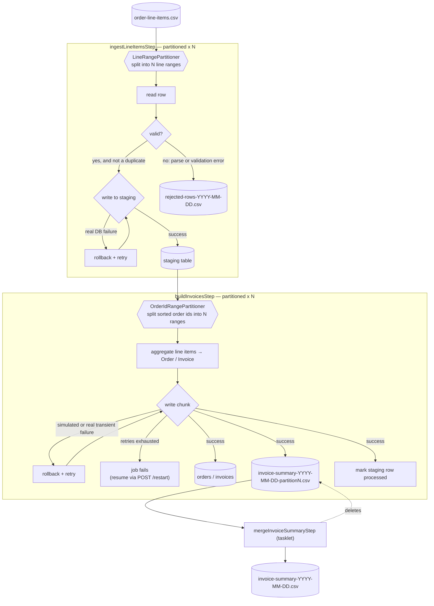
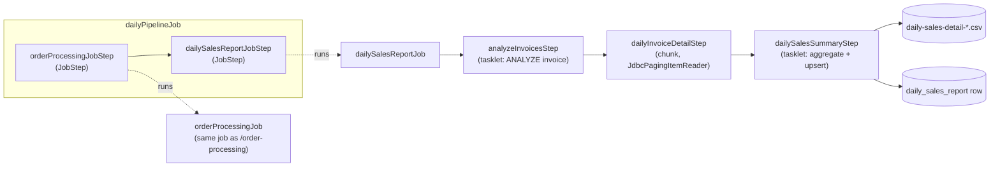
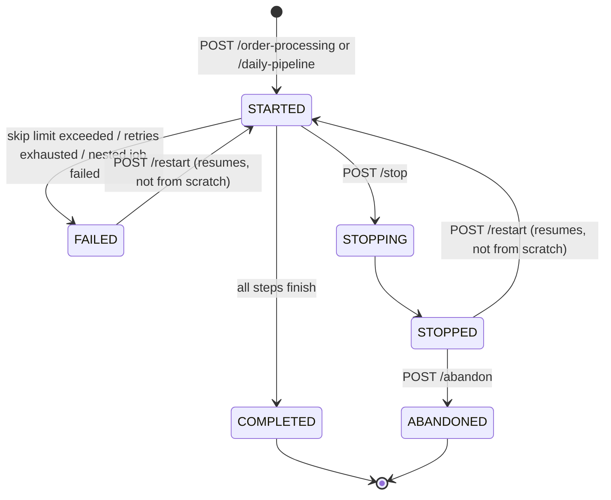

# Daily E-commerce Order & Invoice Processing

A Spring Batch demo that ingests a CSV of order line items, validates and aggregates them into invoices, and persists the results to PostgreSQL — with real fault-tolerance (skip, retry), partitioned parallel processing, operational job control, job composition, and a full observability stack.

## What it does

1. **Ingest** — reads a CSV of raw order line items, validates each row, and lands valid ones in a staging table. Malformed rows (bad CSV format, non-numeric price, bad date) and business-rule violations (negative quantity/price, blank customer/order id) are skipped and logged to `rejected-rows-<businessDate>.csv`, not silently dropped or allowed to crash the job. The file is reset for each new run but left intact on a restart, so rows rejected before a failure are never lost. A real DB failure (dropped connection, lock timeout) is retried instead, never skipped.
2. **Aggregate & invoice** — groups staged line items by order, computes tax/totals, and persists an `Order` + `Invoice` per order. A genuinely simulated transient-write failure exercises the retry policy on every run; a real DB failure is retried the same way — but unlike a malformed row, it's never silently skipped, since a skipped invoice would vanish with no audit trail. If retries are exhausted, the job fails loudly and is meant to be resumed via `POST .../restart`, not silently patched over.
3. **Merge** — recombines the partitioned output into one `invoice-summary-<businessDate>.csv`.

A separate **daily pipeline** job composes the whole order-processing job above with a second, downstream **daily sales report** job — reading that day's invoices, writing a detail CSV, and upserting a per-day summary (invoice count, totals, top customer) — as a single orchestrated run. See [Job composition](#job-composition-daily-pipeline) below.

The whole pipeline runs partitioned across configurable worker threads, is idempotent on re-trigger (both at the job-instance level and the row level), and exposes REST endpoints to launch, inspect, stop, restart, and abandon job executions.

## Tech stack

- Spring Boot 4.1.1 (Java 21)
- Spring Batch 6.0.5 — chunk-oriented steps, partitioning, fault tolerance, `JobOperator`
- Spring Data JPA / Hibernate, PostgreSQL
- Spring Web (REST API)
- Spring Boot Actuator + Micrometer (Prometheus registry, Tracing/OpenTelemetry)
- Lombok
- Prometheus + Grafana + Tempo (via Docker Compose)
- Testcontainers (integration tests — isolated, disposable Postgres per test class)

## Quickstart

Requires Docker and a local JDK 21 (the Maven wrapper is checked in, no local Maven install needed).

```bash
# 1. Start Postgres, Prometheus, Grafana, and Tempo
docker compose up -d

# 2. Run the app (Windows: use mvnw.cmd)
./mvnw spring-boot:run

# 3. Trigger the job
curl -X POST http://localhost:8080/api/batch/jobs/order-processing

# 4. Check its status
curl http://localhost:8080/api/batch/jobs/executions/1
```

The job does **not** run automatically on startup (`spring.batch.job.enabled=false`) — it's always triggered explicitly via the REST endpoint above. Sample input data lives at `src/main/resources/data/order-line-items.csv` (regenerate it with `python generate.py`, which writes ~100,000 rows including a handful of deliberately invalid ones to exercise the skip path).

## REST API

| Method | Endpoint                                                   | Description                                                                    |
| ------ | ---------------------------------------------------------- | ------------------------------------------------------------------------------ |
| `POST` | `/api/batch/jobs/order-processing?businessDate=YYYY-MM-DD` | Launch a new job execution (`businessDate` optional, defaults to today)        |
| `POST` | `/api/batch/jobs/daily-pipeline?businessDate=YYYY-MM-DD`   | Launch order-processing followed by the daily sales report as one composed run |
| `GET`  | `/api/batch/jobs/executions/{id}`                          | Get a job execution's status/counts                                            |
| `POST` | `/api/batch/jobs/executions/{id}/stop`                     | Request a graceful stop of a running execution                                 |
| `POST` | `/api/batch/jobs/executions/{id}/restart`                  | Restart a stopped/failed execution (resumes, doesn't start over)               |
| `POST` | `/api/batch/jobs/executions/{id}/abandon`                  | Mark a non-restartable execution as abandoned                                  |

`stop`/`restart`/`abandon` are backed by Spring Batch's `JobOperator`. Errors map to proper HTTP status codes: `404` for an unknown execution id, `409` for an invalid state transition (e.g. restarting an execution that's still running, or launching a job for a business date that's already completed). That last case is also the reason `businessDate` is overridable on launch: re-triggering with no query param twice on the same calendar day always gets the second one rejected with `409` by design (see Idempotency below) — pass a different `businessDate` to get a fresh run instead of waiting until tomorrow.

## Architecture

### Job flow: order processing


```mermaid
flowchart TD
    CSV[("order-line-items.csv")] --> P1{{"LineRangePartitioner\nsplit into N line ranges"}}

    subgraph Step1["ingestLineItemsStep — partitioned x N"]
        P1 --> R1["read row"]
        R1 --> V1{"valid?"}
        V1 -- "yes, and not a duplicate" --> W1{"write to staging"}
        V1 -- "no: parse or validation error" --> REJ[("rejected-rows-YYYY-MM-DD.csv")]
        W1 -- "real DB failure" --> RETRY1["rollback + retry"]
        RETRY1 --> W1
        W1 -- "success" --> STG[("staging table")]
    end

    STG --> P2{{"OrderIdRangePartitioner\nsplit sorted order ids into N ranges"}}

    subgraph Step2["buildInvoicesStep — partitioned x N"]
        P2 --> AGG["aggregate line items → Order / Invoice"]
        AGG --> WR{"write chunk"}
        WR -- "simulated or real transient failure" --> RETRY2["rollback + retry"]
        RETRY2 --> WR
        WR -- "retries exhausted" --> FAIL["job fails\n(resume via POST /restart)"]
        WR -- "success" --> DB[("orders / invoices")]
        WR -- "success" --> PCSV[("invoice-summary-YYYY-MM-DD-partitionN.csv")]
        WR -- "success" --> MARK["mark staging row processed"]
    end

    PCSV --> MERGE["mergeInvoiceSummaryStep (tasklet)"]
    MERGE --> FINAL[("invoice-summary-YYYY-MM-DD.csv")]
    MERGE -. deletes .-> PCSV
```

Both processing steps are **partitioned**: the input is split into disjoint ranges up front (line ranges for the CSV, sorted order-id ranges for the staging table) so each partition gets its own reader/writer instance and runs fully in parallel — no shared mutable state, no synchronization needed. Partition count is configurable via `batch.partition-grid-size` (default 6) and controls both the number of partitions and the worker thread pool size.

The order-id ranges are computed **in the database**, not in the JVM: `OrderIdRangePartitioner` runs a native `ntile(gridSize) over (order by order_id)` query over the distinct unprocessed ids and gets back only each bucket's `min`/`max` (at most `gridSize` rows). Memory use therefore doesn't grow with the number of orders, buckets are near-equal in size, and every order lands in exactly one partition. With fewer orders than partitions, the extra partitions simply get empty ranges.

- **`ingestLineItemsStep`** — reads the CSV, validates each row against a set of pluggable business rules, and writes valid, not-already-staged rows to a staging table. Malformed/invalid rows are skipped (with full audit trail); a real DB failure while writing to staging is retried instead, never skipped.
- **`buildInvoicesStep`** — reads unprocessed orders from staging, aggregates their line items into an `Order`/`Invoice`, and writes the result to three places in one transaction: the database, a per-partition CSV summary, and back to staging (marking it processed). Both a simulated transient failure and a real DB failure demonstrate the retry policy — the chunk rolls back cleanly and retries; if retries are ever exhausted, the step (and job) fails outright rather than silently skipping an invoice. `StagedOrderItemReader` fetches order ids page-by-page via keyset pagination (`orderId > lastSeenId`, capped by `batch.order-id-page-size`) rather than loading a partition's entire id range into memory at once, and loads each page's line items (plus which orders are already invoiced) with one query per page instead of per order.
- **`mergeInvoiceSummaryStep`** — recombines the per-partition invoice-summary files into the single `invoice-summary-<businessDate>.csv`, then removes the partition files.

### Job composition: daily pipeline

`dailyPipelineJob` nests two whole jobs as steps of a parent job (Spring Batch's `JobStep`), rather than being its own hand-written flow:


```mermaid
flowchart LR
    subgraph Pipeline["dailyPipelineJob"]
        S1["orderProcessingJobStep\n(JobStep)"] --> S2["dailySalesReportJobStep\n(JobStep)"]
    end
    S1 -. runs .-> J1["orderProcessingJob\n(same job as /order-processing)"]
    S2 -. runs .-> J2["dailySalesReportJob"]
    J2 --> A0["analyzeInvoicesStep\n(tasklet: ANALYZE invoice)"]
    A0 --> D1["dailyInvoiceDetailStep\n(chunk, JdbcPagingItemReader)"]
    D1 --> D2["dailySalesSummaryStep\n(tasklet: aggregate + upsert)"]
    D2 --> OUT1[("daily-sales-detail-*.csv")]
    D2 --> OUT2[("daily_sales_report row")]
```

- Launched via `POST /api/batch/jobs/daily-pipeline`, same `businessDate`/`inputFile` parameter shape as `/order-processing`.
- **Restart resumes correctly at the job level, not just the step level**: if the report job fails after order processing already completed, `POST .../restart` re-runs only the failed nested job — the already-completed `orderProcessingJob` execution is left untouched, exactly like a normal step restart.
- A quirk worth knowing: calling `/daily-pipeline` for a `businessDate` already covered by a standalone `/order-processing` run doesn't `409` the way two `/order-processing` calls would — the orchestrator's own instance is new, but the nested order-processing attempt inside it fails, so the response is `200` with `"status": "FAILED"` in the body.
- The report's `issuedDate` filter is keyed off `businessDate`, and invoices themselves are now stamped with that same `businessDate` too — so a `businessDate` override (e.g. to dodge a same-day conflict) still produces a correct, non-empty report for that date, not just for a same-day run.

See `CLAUDE.md` for the full mechanics (`JobOperator` vs. `JobLauncher` inside `JobStep`, the `@Primary`/`JobRegistry` wiring this required, and what's actually verified by `DailyPipelineJobRestartTest`).

### Fault tolerance

- **Skip**: malformed/invalid rows in step 1 are skipped up to `batch.skip-limit`, logged with full context, and don't fail the job. Skip is reserved for genuine data-quality problems — it's never used for infrastructure failures.
- **Retry**: real DB failures (a dropped connection, a lock timeout) and step 2's simulated transient failure are retried up to `batch.retry-limit` in both steps. If retries are exhausted, the step/job fails outright rather than silently skipping the row — a skipped write would have no audit trail, so failing loudly (and resuming via `POST .../restart`) is the safer default.
- **Backoff with jitter**: retries wait before the next attempt using an exponential backoff with random jitter (`ExponentialRandomBackOffPolicy`, shared by both worker steps). Partitions run concurrently, so one DB blip fails several at once; without jitter they'd all retry in lockstep against a database that is still recovering. The actual wait is logged as `Backing off N ms before retrying`. Tune via `batch.retry-backoff-*` (see Configuration).
- **Idempotency**: re-triggering the job is safe at three levels — a second launch for the same business date against an already-completed run is rejected outright (`409`); re-ingesting the same input on a _different_ business date skips already-staged/already-invoiced rows rather than duplicating; and a DB-level unique constraint on the staging table (`order_line_item_staging (order_id, product_id)`) is the guard that drops re-delivered rows and resolves races between partitions or overlapping runs. Staging rows are inserted with `ON CONFLICT DO NOTHING`, so the loser of a race is dropped instead of aborting the chunk.

### Operational control

Spring Batch's `JobOperator` is exposed via REST for stopping, restarting, and abandoning executions — restart resumes from where the job left off (correct `JobParameters` handling under the hood), it isn't a fresh run from scratch.


```mermaid
stateDiagram-v2
    [*] --> STARTED: POST /order-processing or /daily-pipeline
    STARTED --> COMPLETED: all steps finish
    STARTED --> FAILED: skip limit exceeded / retries exhausted / nested job failed
    STARTED --> STOPPING: POST /stop
    STOPPING --> STOPPED
    STOPPED --> STARTED: POST /restart (resumes, not from scratch)
    FAILED --> STARTED: POST /restart (resumes, not from scratch)
    STOPPED --> ABANDONED: POST /abandon
    COMPLETED --> [*]
    ABANDONED --> [*]
```

`stop`/`restart`/`abandon` operate on an execution id regardless of which endpoint launched it — the same state machine applies to a `dailyPipelineJob` execution as to a plain `orderProcessingJob` one; restarting a failed pipeline execution resumes only its failed nested job, not the whole thing from scratch (see [Job composition](#job-composition-daily-pipeline) above).

## Configuration

All under the `batch.*` prefix (`application.properties`):

| Property                                  | Default                               | Description                                                        |
| ----------------------------------------- | ------------------------------------- | ------------------------------------------------------------------ |
| `batch.input-csv-path`                    | `classpath:data/order-line-items.csv` | Source CSV                                                         |
| `batch.rejects-file-path`                 | `rejected-rows.csv`                   | Skip audit log, one file per business date (`-<businessDate>` inserted before the extension; reset per new run, kept on restart) |
| `batch.invoice-summary-output-path`       | `invoice-summary.csv`                 | Base name for the final merged output (`-<businessDate>` inserted before the extension)|
| `batch.tax-rate`                          | `0.18`                                | Applied to invoice subtotals                                       |
| `batch.chunk-size`                        | `5`                                   | Items per commit chunk                                             |
| `batch.skip-limit`                        | `20`                                  | Max skips before the step fails                                    |
| `batch.retry-limit`                       | `3`                                   | Max retry attempts on transient write failure                      |
| `batch.retry-backoff-initial-interval-ms` | `500`                                 | Initial retry wait (jittered)                                      |
| `batch.retry-backoff-multiplier`          | `2.0`                                 | Wait multiplier between successive retry attempts                  |
| `batch.retry-backoff-max-interval-ms`     | `10000`                               | Upper bound on a single retry wait                                 |
| `batch.simulate-transient-write-failures` | `true`                                | Toggle the retry-policy demo                                       |
| `batch.partition-grid-size`               | `6`                                   | Partitions (and worker threads) per step                           |
| `batch.order-id-page-size`                | `500`                                 | Max order ids fetched per keyset page in step 2's reader           |
| `batch.report-page-size`                  | `1000`                                | Rows per keyset page in the daily report's detail reader           |
| `batch.daily-sales-report-output-dir`     | `daily-sales-reports`                 | Output directory for the daily pipeline's detail/top-customer CSVs |
| `batch.report-top-customer-count`         | `3`                                   | Top-N customers by spend included in the daily sales report        |

## Observability

`docker compose up -d` also starts:

- **Grafana** — `http://localhost:3000` (anonymous viewer access, no login needed):
  - _Batch Job & Step Executions_ — every job/step execution row, queried directly from Postgres, plus a step timeline (bars at real start/end times, partitions side by side) and a duration-per-run bar chart. Set the dashboard's **App timezone** variable if the app doesn't run in `Europe/Istanbul`.
  - _Batch Metrics (Prometheus)_ — run count, max duration, average job duration and average duration per step, queried from Prometheus.
- **Prometheus** — `http://localhost:9090`, scraping `/actuator/prometheus` every 15s.
- **Tempo** — one trace per job run: job span → step spans (including each partition) → per-chunk spans within each partition. No UI of its own; browse traces via Grafana's "Tempo" datasource (`http://localhost:3000`). Actuator's own traffic (Prometheus's 15s scrape, health checks) is deliberately excluded from tracing so it doesn't drown out the traces that matter.

Actuator endpoints:

```bash
curl http://localhost:8080/actuator/health
curl http://localhost:8080/actuator/metrics/spring.batch.job
curl http://localhost:8080/actuator/prometheus
```

## Project structure

```
src/main/java/com/batch/demo/
  batch/
    control/     JobOperator wrapper (stop/restart/abandon)
    dto/         Cross-step data transfer objects
    listener/    Skip listener → rejects audit log
    reject/      Rejected-record sink abstraction
    step1/       Ingest step: CSV mapping, validation processor, line-range partitioner, duplicate-safe staging writer
    step2/       Invoice step: aggregation, retry simulation, order-id partitioner (ntile), CSV merge
    step3/       Daily sales report step: detail CSV field extractor, summary tasklet
    validation/  Pluggable business-rule validators (Open/Closed)
  config/        Job/step wiring, batch properties, retry backoff policy, daily pipeline composition (JobStep)
  domain/        JPA entities
  repository/    Spring Data repositories
  web/           REST controller, exception handling, DTOs
```

## Testing

```bash
./mvnw test                                              # all tests
./mvnw test -Dtest=InvoiceCalculatorTest                  # single class
./mvnw test -Dtest=DefaultOrderLineValidatorTest#rejectsANegativeQuantity   # single method
```

`DefaultOrderLineValidatorTest` and `InvoiceCalculatorTest` are plain unit tests, no Spring context. Every Spring-context test class, including `DemoApplicationTests`, spins up its own disposable Postgres via **Testcontainers** — no manual setup needed, just a running Docker daemon — so the whole suite is isolated from whatever's in the shared dev database.

The integration suite exercises the fault-tolerance and operational-control behavior end-to-end, not just the happy path:

- **Skip path** — malformed/invalid rows are actually skipped, valid ones still processed, and `rejected-rows-<businessDate>.csv` gets the right entries (`IngestLineItemsSkipPathTest`); exceeding `batch.skip-limit` genuinely fails the step (`IngestLineItemsSkipLimitExceededTest`).
- **Retry, simulated and real** — the demo's simulated transient failure recovers via retry (`BuildInvoicesRetrySuccessTest`), and so does a _real_, correctly-classified DB connection failure, injected via an in-process `DataSource` proxy that matches specific SQL statements (`BuildInvoicesDbConnectionRetryTest`, `IngestLineItemsDbConnectionRetryTest`).
- **Retry backoff** — retry backoff intervals are shrunk to 10–50 ms in `application-test.properties`, so the retry tests exercise the real backoff path without sleeping for seconds.
- **Failure + restart** — a genuine mid-step failure (via the same fault-injection technique) followed by `POST .../restart` resumes cleanly with no duplicated or lost rows, for both steps (`OrderProcessingJobFailureRestartTest`, `IngestLineItemsRestartTest`).
- **Idempotency** — a same-day relaunch is rejected (`409`), and a relaunch on a different business date against the same input doesn't duplicate any rows (`OrderProcessingJobIdempotencyTest`).
- **Unique constraint** — a duplicate `(orderId, productId)` staging insert is dropped by `ON CONFLICT DO NOTHING` instead of aborting the chunk (`StagingUniqueConstraintTest`).
- **Page-level lookups** — `StagedOrderItemReaderTest` pins that the invoice step's reads cost a fixed number of queries per page of orders rather than two per order, that already-invoiced orders (even a whole page of them) are skipped, and that `StagingMarkProcessedItemWriter` updates exactly the given rows.
- **Partitioning boundaries** — `OrderIdRangePartitionerTest` verifies the `ntile`-based ranges cover every order id exactly once, including when there are fewer orders than partitions.
- **Operational control** — `stop` genuinely interrupts a running job and `abandon` transitions a stopped execution correctly (`JobControlOperationsTest`). The REST routes for stop/restart/abandon, and their 404 (unknown execution) / 409 (not running, already complete) mapping, are covered separately through MockMvc (`JobControlEndpointsTest`).
- **Real parallelism** — every other test pins `batch.partition-grid-size=1` for determinism; `PartitionedProcessingTest` raises it back up to verify multi-partition runs merge correctly with nothing dropped or duplicated across partition boundaries.
- **Status endpoint counts** — `GET /executions/{id}` reports job-level read/write/skip counts that match the real work done, not double-counted (a partitioned manager step already carries its workers' totals, so `JobExecutionStatusResponse` skips the `:partition` worker executions) — checked under real `gridSize=3` partitioning (`PartitionedJobStatusEndpointTest`). For `dailyPipelineJob`, whose own steps are two `JobStep`s, each `JobStep` carries its nested job's totals (`NestedJobCountsRollupListener`), so the pipeline reports the work of both nested jobs rather than 0 (`DailyPipelineJobStatusEndpointTest`).
- **Job composition** — the daily pipeline runs both nested jobs and produces a correct report (`DailyPipelineJobTest`), a same-day relaunch and cross-endpoint conflict both fail as expected (`DailyPipelineJobIdempotencyTest`), and a failure in the report job followed by restart resumes only that nested job — proven by inspecting nested `JobInstance`/`JobExecution` counts before and after, not just the top-level status (`DailyPipelineJobRestartTest`). The report job's edge cases — a date with no invoices (zeroed report, header-only CSVs), re-running for an already-reported date (the existing row is updated in place), and a re-run after the day's invoices are gone (no stale top customer left behind) — are in `DailySalesReportEdgeCasesTest`.
- **Report detail reader** — the keyset-paged detail reader returns every invoice of the day exactly once across page boundaries, resumes without repeating or skipping an invoice at any position (inside a page, on a boundary, at the end), and the detail CSV matches the invoices in the database (`DailyInvoiceDetailReaderTest`). The report job's first step analyzes the freshly loaded `invoice` table so the reader gets a good query plan; a test checks it runs first and that planner statistics exist afterwards (`AnalyzeInvoicesStepTest`).
- **Tracing** — every partition of both worker steps produces per-chunk spans, and they all share one trace instead of starting disconnected ones — proof the trace context actually survives the hop onto `batchTaskExecutor`'s worker threads (`ChunkTracingSpansTest`); actuator requests produce no spans while real application requests still do (`ActuatorObservationExclusionTest`).

## Known limitations (demo scope)

- No schema migration tool (Flyway/Liquibase) — `spring.jpa.hibernate.ddl-auto=update`.
- With `ddl-auto=update`, Hibernate adds the staging unique constraint to an existing table on boot but only logs a warning if the table already holds duplicates — clean those up first.
- The row-level dedup key (`orderId` + `productId`) assumes an order has at most one line item per product; it also detects and drops exact re-deliveries but doesn't reconcile _corrections_ — a resend with a different quantity/price is treated as a duplicate and silently dropped, the original wins.
- Grafana runs with anonymous viewer access and default credentials — fine for local use, not for anything internet-facing.
- Actuator endpoints are unauthenticated.
- Tracing samples every job execution (`management.tracing.sampling.probability=1.0`) — a real deployment would sample a small fraction instead.

See `CLAUDE.md` for a deeper architectural walkthrough, including the specific Spring Batch 6.0 package-relocation gotchas and design rationale for each major decision.
